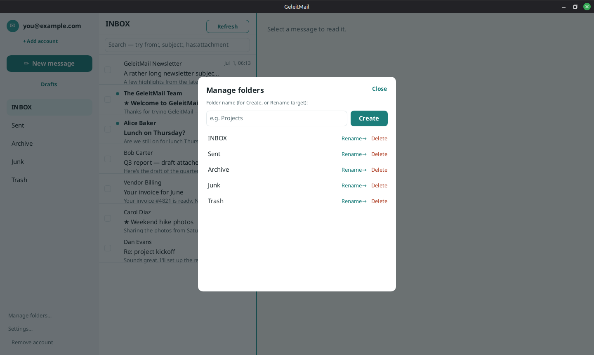
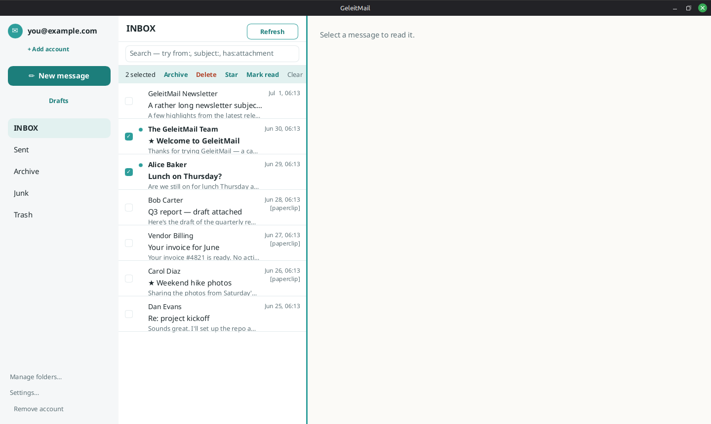

# Organizing your mail

See also: [reading](reading-mail.md) · [searching](searching-mail.md).

Actions apply **instantly** to what you see, then sync to your provider in the background. If a sync
hiccup happens, the change simply reconciles on the next refresh — nothing is lost or duplicated.

## On a single message

At the top of an open message:

- **★ Star / ☆** — flag a message you want to find again. Starred messages show a ★ in the list.
- **Archive** — move it out of the inbox into your Archive folder.
- **Delete** — move it to Trash. (If you're already *in* Trash, Delete removes it **permanently**.)
- **Move…** — pick any folder to move the message into.
- **Spam / Not spam** — move a message into Junk, or (when you're in Junk) back to your Inbox.
- **Mark as unread** — bring back the unread dot.

## Trash

Open the **Trash** folder and choose **Empty Trash** to permanently delete everything in it. (You can
also delete a single trashed message permanently with **Delete**, as above.)

## Managing folders

Choose **Manage folders…** on the left to **create**, **rename**, or **delete** folders. Type a name
and **Create**; or type a new name and choose **Rename→** next to a folder; or **Delete** a folder.
The folder list updates to match your provider.

## Acting on several messages at once

Each message row has a checkbox on the left. Tick a few and a bar appears with bulk actions:
**Archive**, **Delete**, **Star**, and **Mark read** — applied to everything selected. **Clear**
deselects. Switching folders also clears the selection.

