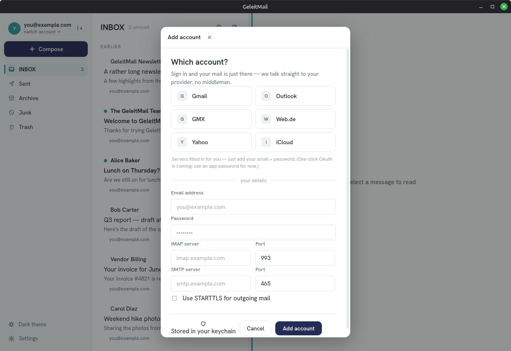
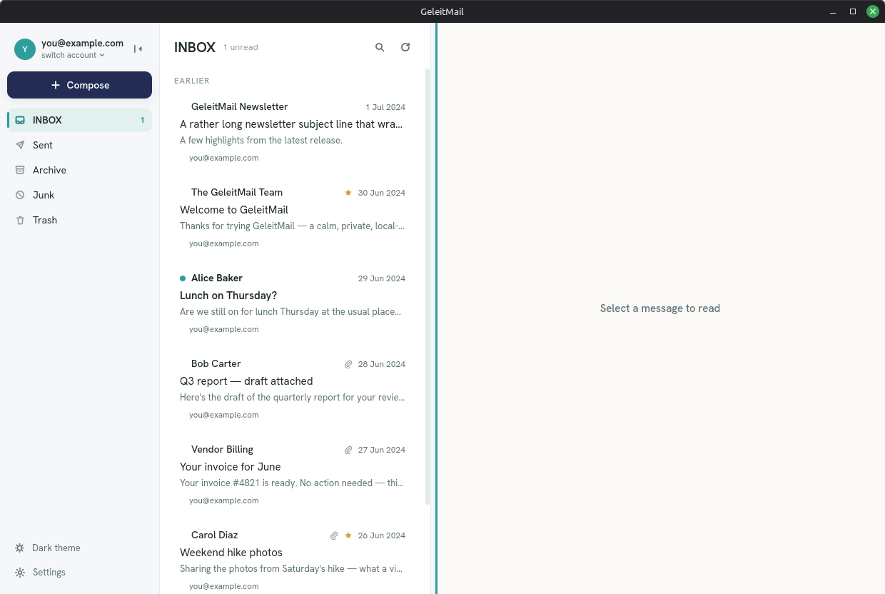
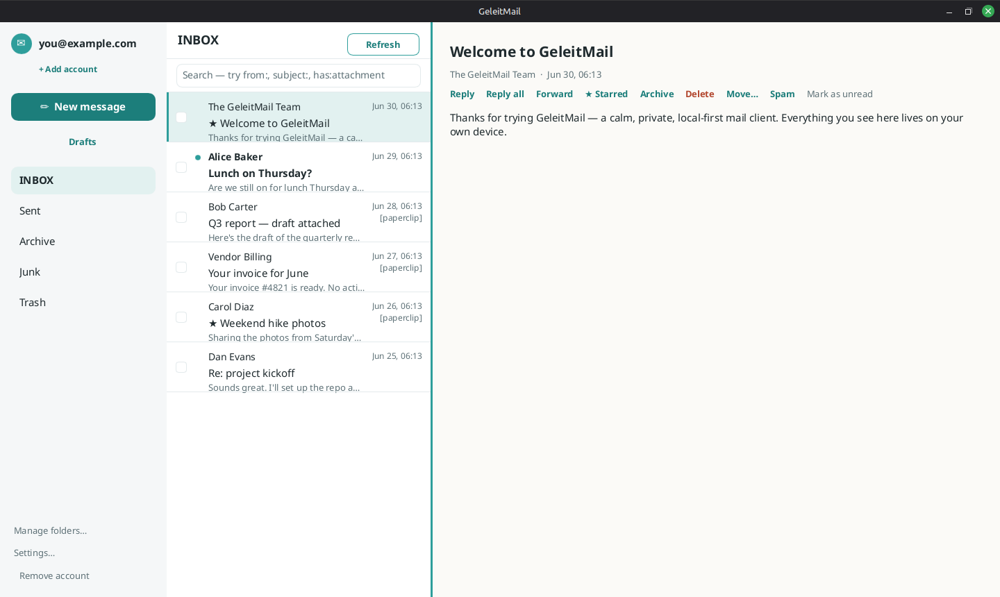

# Reading your mail

This page covers signing in and reading. See also: [writing](writing-mail.md),
[organizing](organizing-mail.md), [searching](searching-mail.md),
[multiple accounts](accounts.md), [keyboard & appearance](shortcuts-and-appearance.md), and
[privacy](privacy.md).

## Adding your account

The first time you open GeleitMail, it asks you to add an account. Fill in:

- **Email** — your address (e.g. `you@example.com`).
- **Display name** — optional, how your name should read on messages you send.
- **IMAP server** and **Port** — your provider's incoming-mail server (often `imap.<provider>`
  on port `993`). Your provider's help pages list these.
- **Username** — usually your full email address.
- **Password** — your mail password (some providers ask you to create an *app password* for other
  mail apps).
- **Outgoing (SMTP) server**, **Port**, and **STARTTLS** — your provider's sending server (often
  `smtp.<provider>` on port `465`, or `587` with STARTTLS). Used when you send.
- **Signature** — optional; appended to messages you write.

Choose **Add account**. GeleitMail signs in, downloads your inbox, and shows your mail. Your details
stay on your own device — your password is saved securely in your system keychain, so it's
remembered the next time you open GeleitMail. (The wizard also has buttons for common providers that
fill the server settings in for you — you just add your email and password.)

> Sign-in is manual IMAP/SMTP for now. One-click Gmail/Outlook (OAuth) is planned.

> If your keychain is locked (some setups lock it until you sign in), the first Refresh may ask you
> to re-enter your password via the same form.

When you open GeleitMail you see three areas, left to right:

- **Your folders** on the left (Inbox, Sent, and so on). Click one to switch to it.
- **Your messages** in the middle — newest first. Each row shows who it's from, the subject, a
  short preview, and the date. A small dot marks messages you haven't read yet, and a paperclip
  shows when a message has an attachment.
- **The reading area** on the right, where the message you pick opens.

Messages are **grouped by day** (Today, Yesterday, Earlier), and each row also shows a small coloured
dot for the account it belongs to.

Drag the divider between the message list and the reading area to make either wider; your choice is
remembered next time you open GeleitMail.

When several messages are part of the same back-and-forth, a small **· conversation N** marker shows
how many messages are in that thread.

## Opening a message

Click a message and it opens on the right, showing the subject, who it's from, the date, and the
text of the message. The row you're reading is marked with a soft highlight and a coloured edge.

The action buttons — **Star, Reply, Reply all, Forward, Archive, Move…, Delete, Unread, Save** — sit
across the **top** of the reading area, above the sender and subject, so they don't move as the
subject wraps.

Opening a message marks it as read and its unread dot disappears — unless you've turned off **Mark as
read when opened** in **Settings → General**, in which case it stays unread until you decide. To make
a read message unread again, choose **Unread** at the top of the reading area.

Messages written in rich (HTML) formatting are shown **formatted** — with their colors, fonts,
layout, images, and links intact, exactly as the sender wrote them. You can **scroll** the message,
**select text** by dragging and copy it with **Ctrl+C**, and **click links** (they open in your
normal web browser). Plain-text messages show as before.

To display formatted mail, GeleitMail uses the web engine that already ships with your operating
system — the same one that draws web pages elsewhere on your computer. It does **not** bundle a
browser of its own. Every message is then locked inside a sealed compartment, where:

- **Scripts cannot run.** Code hidden in a message is inert — it can't do anything, even if the
  message is deliberately malicious.
- **Nothing is fetched from the internet.** Tracking pixels, remote images, and remote styling are
  all blocked, so simply opening a message tells the sender nothing — not that you read it, not
  when, not from where.
- **A message cannot reach the rest of the app**, your files, or your other mail.

Nothing loads remotely until you ask for it (see below), and no message has ever been able to run
code — that stays true whether or not you load its images.

When a message *did* contain remote content, you'll see a small **"Remote content blocked"** note
with a **Load images** button. Nothing remote loads until you choose to: click it and GeleitMail
fetches that one message's images and re-shows it with them in place. (Scripts are never run, even
then, and only that message's images are fetched.)

## Attachments

When a message has files attached, they appear as **chips** just under the sender and subject — each
showing the file's name and size. Choose the **save icon** on a chip to keep that file on your
computer; pick where to put it and GeleitMail downloads it from your provider and writes it there.
(Attachments aren't stored on your device until you save one, so saving needs a connection.)

## Saving and opening message files

Choose **Save** at the top of an open message to keep a copy on your computer as a **`.eml`** file —
the standard format any mail app can read. Pick where to put it; GeleitMail suggests a name based on
the subject.

To read a `.eml` file you already have — one you saved here, or that someone sent you — choose **Open
mail file…** at the bottom of the folder list and pick it. GeleitMail files it under a local **Saved**
folder and opens it, so it reads just like any other message. Saved messages stay on your device and
aren't uploaded to your provider.

## Writing, replying, and organizing

Choose **Compose** on the left to write, or use **Reply**, **Reply all**, and **Forward** at the top
of an open message. See [writing your mail](writing-mail.md) for the details (Cc, recipient chips,
attachments, signature), and [organizing your mail](organizing-mail.md) for archiving, deleting,
moving, and Undo.

## Getting new mail

Choose **Refresh** at the top of the message list to fetch new mail from your provider. While it
works, the button reads *Refreshing…* and a quiet line shows what's happening — *Checking for new
mail…*, then *Catching up…* with a count as older messages download in the background. The app
stays responsive the whole time, so you can keep reading. When it finishes, the list updates with
anything new. If it can't reach your provider, a short message explains what to try; your existing
mail stays put.

Everything you see is kept on your own device, so the list stays fast and works offline — refresh is
the moment GeleitMail talks to your provider to catch up.

## Your data is encrypted on this device

The local copy of your mail is **encrypted at rest** — on disk it's unreadable ciphertext. The key
is kept in your operating system's keychain and applied automatically when GeleitMail opens, so you
never type a separate passphrase. (If you wipe the keychain, the local copy can't be opened; just
add the account again to re-download it.)

## Reading offline

Because your mail lives on your own device, you can read everything you've synced with no internet
connection. Refresh is the only thing that needs the network; the rest keeps working offline.

## More than one account

GeleitMail can hold several accounts at once — see [accounts](accounts.md) for adding more, switching
between them, and removing one.
