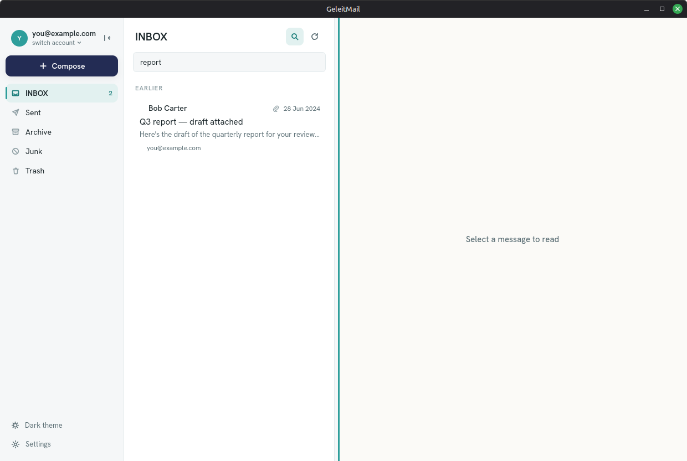

# Searching your mail

See also: [organizing](organizing-mail.md) · [accounts](accounts.md).

Choose the **magnifier** at the top of the message list to open the **search box**, and type. Results
appear as you type — instantly, and **offline**: GeleitMail searches a private index kept on your own
device (inside the encrypted database), so it never sends your search anywhere. Each result shows a
snippet of the matching text so you can see *why* it matched. Clear the box to return to your folder.

## Operators

Narrow a search with simple operators, alone or combined with words:

- `from:alice` — match the **sender** (name or address).
- `subject:invoice` — match the **subject** only.
- `has:attachment` — only messages with attachments.

For example, `from:alice subject:report has:attachment` finds messages from Alice whose subject
mentions "report" and that carry an attachment. Plain words (no operator) match the sender, subject,
or body.

## Searching every account

Switch to the **All inboxes** view from the account menu (see [accounts](accounts.md)) and search
there to look across **all** your accounts at once. Opening a result adopts the account it belongs to,
so you can reply from the right address.
