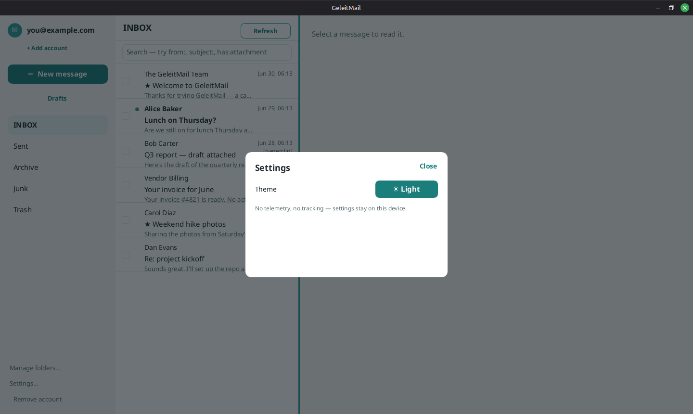
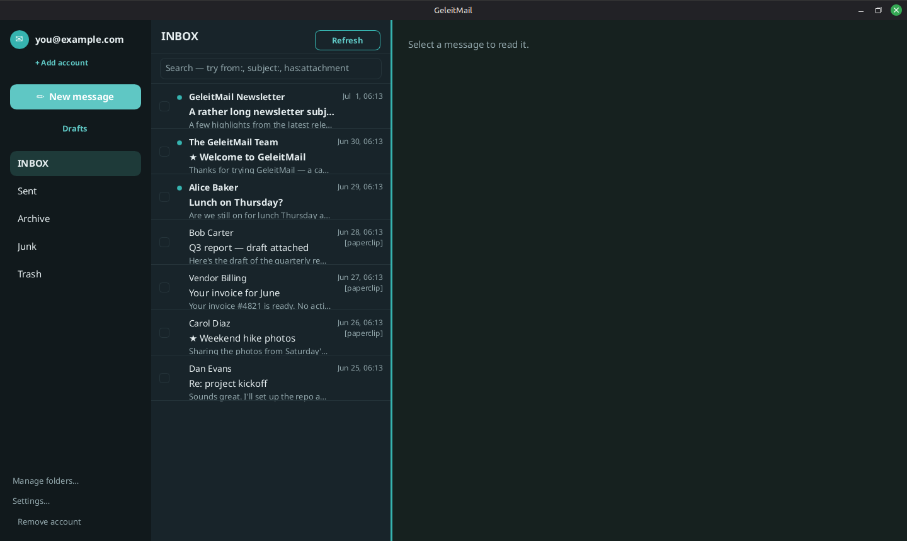

# Keyboard shortcuts & settings

See also: [reading](reading-mail.md) · [organizing](organizing-mail.md).

## Keyboard shortcuts

When you're browsing your mail (not typing in a box):

| Key | Action |
| --- | --- |
| `j` / `↓` | Next message (opens it) |
| `k` / `↑` | Previous message (opens it) |
| `c` | Compose a new message |
| `r` | Reply to the open message |
| `f` | Forward the open message |
| `e` | Archive the open message |
| `#` | Delete the open message (to Trash; if already in Trash, permanently delete after a confirm) |
| `z` | Undo the last archive/delete |
| `/` | Open search |
| `Esc` | Close the open window/overlay, or the search box |

Shortcuts pause while you're typing in a field (so the letters land in your text), and resume when
you click back out.

## Settings

Choose **Settings** at the bottom of the left rail to open the Settings window. Everything here stays
**on this device** — there's no account or cloud involved. The tabs:

- **Accounts** — your accounts, each with a **Remove** button (see [accounts](accounts.md)), a
  **Signature** for the account you're viewing, and **Add account**.
- **General** — **Mark as read when opened**. Leave it on and opening a message clears its unread dot;
  turn it off to keep messages unread until you decide.
- **Appearance** — the **theme**: **Light** ("Soft daylight") or **Dark** ("Soft dusk"). Your choice
  is remembered and applied the next time you open GeleitMail.
- **Privacy** — **Block remote images** (on by default; see [privacy](privacy.md)).
- **Notifications** — whether to be notified about new mail.

