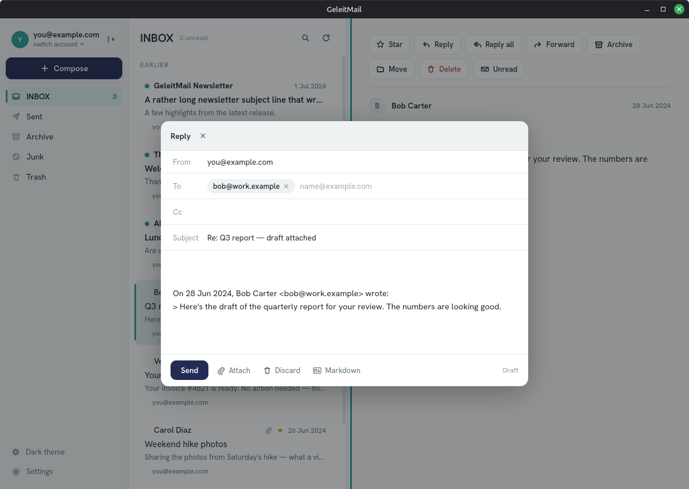

# Writing your mail

See also: [reading](reading-mail.md) · [organizing](organizing-mail.md) ·
[accounts](accounts.md).

## A new message

Choose **Compose** on the left. Fill in:

- **To** — type an address and press **Enter** (or a comma) to turn it into a **chip**; add as many as
  you like, and remove one with its **✕**. You can also paste several comma-separated addresses at
  once. A repeated address is kept just once. As you type, GeleitMail suggests people you've had mail
  from — choose one to add it as a chip, or press **Esc** to dismiss the list.
- **Cc** — optional; the same chips and suggestions.
- **Subject** and the **message body**.

Then choose **Send**. GeleitMail sends through your account's outgoing (SMTP) server (set up when you
added the account) and saves a copy to your **Sent** folder. Sending happens in the background, so
the app stays responsive. To throw a message away, choose **Discard**.

**No connection?** Your message isn't lost. GeleitMail keeps it in an **outbox** and sends it the next
time it reaches your provider — a quiet line under **Compose** shows how many are waiting to go. You can
close GeleitMail in the meantime; the outbox is remembered.

Click that line to open the **Outbox** and see what's waiting. If your provider *rejects* a message — a
mistyped address, say — it's shown there with the reason (*"couldn't send"*) rather than tried forever;
choose **Retry** to send it again, **Edit** to reopen it in Compose and fix it first, or **Discard** to
throw it away. **Edit** brings the whole message back — recipients, subject, body, and attachments — so
you can correct the address and send again without retyping; the original waits in the Outbox until the
edited version goes out, so you lose nothing if you change your mind. You can **Discard** a message
that's still waiting, too, to cancel it before it goes.

## Replying and forwarding

Open a message and use the action buttons at the top of the reading area:

- **Reply** — writes back to the sender, quoting the original.
- **Reply all** — also includes everyone who was on the original (minus your own address).
- **Forward** — sends the message on to someone new.

Replies keep the conversation threaded, and the **from** address is automatically the account you're
reading in — including in the merged "All inboxes" view, where it's the account that received the
message.

## Attachments

In the compose window, choose **Attach** to pick one or more files with your system's file chooser.
Each attached file shows as a chip with its name; remove one with its **✕**. Attachments are included
when you send. (There's a size limit of 25 MB in total, so an over-large file is turned away with a
clear message rather than failing mid-send.)

## Saving a draft

Not ready to send? Choose **Save draft** in the compose footer. GeleitMail stores the message —
recipients, subject, body, **and any attachments** — on your device and closes the window. Open
**Drafts** in the folder list to see everything you've saved, newest first (along with any drafts you
started elsewhere — see below); choose one to pick up exactly where you left off, attachments and all. Continuing to edit updates the same draft, and
**sending it removes it from Drafts** automatically. To throw a saved draft away, hover its row and
choose the trash icon.

Drafts live only on this device (encrypted, like the rest of your mail) — they aren't uploaded to your
provider.

If you'd rather see your drafts in other mail apps too, turn on **Sync drafts to your provider** in
**Settings → Privacy**. It's **off by default**: with it on, each draft you save is also kept in your
provider's **Drafts** folder, so your phone or webmail can see it. Editing a saved draft updates the
copy there, and sending or deleting it removes the copy. Turn the setting back **off** and GeleitMail
takes those copies off your provider again, leaving your drafts here. (If your account has no Drafts
folder, GeleitMail simply keeps the draft on this device.)

## Drafts you started somewhere else

**Drafts** shows them too. If your provider keeps a Drafts folder, the messages you began in webmail or
on your phone are in the same list as the ones you saved here, newest first — one **Drafts**, whatever
you started, wherever you started it. A draft your provider is keeping for you is marked **"On your
provider"**; everything else in the list is one you saved here.

Choose one and it opens in the compose window, ready to continue. If it has files attached, GeleitMail
fetches them from your provider as it opens, so that part needs a connection — and if a file can't be
fetched, the draft won't open at all, rather than open without it and lose it when you save.

**Saving it moves the draft here.** It becomes a draft on this device, and the copy on your provider is
removed — so it will no longer show up in webmail or on your phone. (If you've turned on **Sync drafts
to your provider**, a fresh copy is put back there, so your other devices still see it.) **Sending** it
removes their copy too: a message you've sent isn't a draft any more. Close the window without saving
and nothing changes on your provider.

The trash icon on such a row deletes the draft **from your provider for good** — it isn't moved to
Trash and there's no undo, so GeleitMail asks you to confirm first.

One thing to know: GeleitMail writes plain text, and webmail usually writes formatted text. So
continuing a draft you wrote with **formatting** keeps every word and drops the styling — and because
saving replaces the original, GeleitMail asks you first.

GeleitMail checks your provider's Drafts folder each time you open **Drafts**; **Refresh** at the top of
the list checks again. Your own drafts are always there instantly, connection or not.

## Markdown formatting

Turn on **Markdown** in the compose footer to write with light formatting — `**bold**`, `*italic*`,
lists, `> quotes`, links, and tables. GeleitMail sends both a formatted version and a plain-text
version, so people whose mail apps don't show formatting still get a perfectly readable message. The
toggle is off by default and resets for each new message.

## Your signature

Set a **Signature** per account in **Settings → Accounts** (see [accounts](accounts.md)); it's
appended to messages you compose, reply to, and forward from that account.
